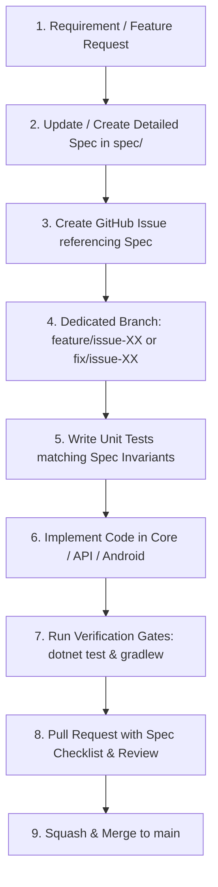

# Marriage Calculator — System Specification Index & SDD Guide

## 1. Introduction & Overview

**Marriage Calculator** is an enterprise-grade digital companion and automated scoring engine for the traditional 21-card "Marriage" game popular throughout Nepal, India, Bhutan, and the broader South Asian diaspora. The platform eliminates manual calculation errors, eliminates slow pen-and-paper tracking, minimizes post-game cash dispute friction through optimized settlement algorithms, and enables real-time synchronization between tables and players.

This repository operates strictly under **Spec-Driven Development (SDD)** principles:
- **Specifications First**: All features, changes, database refactors, and UI behaviors must be specified in the `spec/` suite before implementation.
- **Traceability**: Every GitHub issue and branch must tie directly to specific sections of these specs.
- **Invariant Guarantees**: Code implementations must rigorously preserve domain invariants (such as zero-sum scoring and debt minimization).

---

## 2. Specification Directory Structure

The system specification is organized into focused, modular specifications:

| Document | File Path | Scope & Focus |
| :--- | :--- | :--- |
| **Domain & Game Rules** | [domain-and-rules.md](domain-and-rules.md) | Traditional card game mechanics, card tiers, Maal values, Central Collection algorithm, Normal/Kidnap/Murder modes, and Dublee rules. |
| **System Architecture & Tech** | [architecture-and-tech.md](architecture-and-tech.md) | Clean Architecture layers, .NET 10 Web API, MongoDB schemas, Android Kotlin/Compose, Room DB, SignalR, and multi-tenant user isolation. |
| **API & Real-Time Protocol** | [api-spec.md](api-spec.md) | OpenAPI REST contracts, authentication headers, Game Set CRUD, private friend discovery (7-day invite codes), and SignalR hub events. |
| **Mobile UI & Interaction UX** | [mobile-ui-ux.md](mobile-ui-ux.md) | Screen-by-screen interactions (Login, Dashboard, Setup, Play Game, Round Input, Scoreboard), Dashain/Tihar festival design system, and visual components. |
| **Testing & Quality Assurance** | [testing-and-verification.md](testing-and-verification.md) | Test pyramid, scoring invariants, zero-sum proofs, Android Compose unit tests, API integration tests, and CI/CD verification commands. |
| **Requirements Traceability** | [requirement.md](requirement.md) | High-level business goals, requirements catalog, and historical context. |
| **Implementation Plan** | [plan.md](plan.md) | Evolutionary phase-by-phase implementation log and technical progress tracker. |

---

## 3. Spec-Driven Development (SDD) Lifecycle

### Core Rules for Engineers & Agents
1. **Never code without a spec**: If a requirement is ambiguous or missing, update the relevant `spec/*.md` document first.
2. **Never commit directly to `main`**: All work happens on dedicated branches and merges strictly via Pull Request.
3. **Preserve Domain Invariants**:
   - Zero-sum scoring: sum of Scores = 0 for every game.
   - Zero-sum cash balances: sum of Money = 0.00.
   - Single dealer per game: strictly 1 dealer per hand, progressing clockwise.
   - Fixed point tiers: Maal values are fixed rules based on count held, not arbitrary per-card multipliers.
